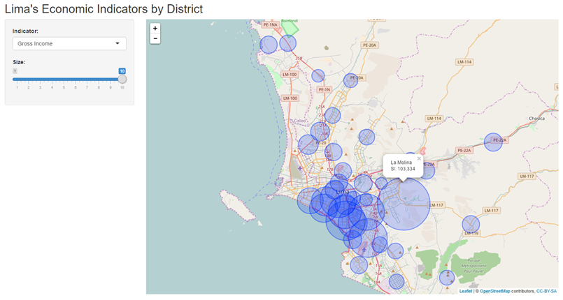

```{r setup, include=FALSE}
knitr::opts_chunk$set(echo = TRUE)
```

##Downloading and cleaning cleaning  
Download source data frame file from INEI webpage containing 2016 census data. Load data into R 
```{r, warning=FALSE, message=FALSE, eval=FALSE}
library(foreign)
library(dplyr)

if (!file.exists("Pobreza.zip")) {
      download.file("http://iinei.inei.gob.pe/iinei/srienaho/descarga/STATA/546-Modulo34.zip", 
                    destfile = "./Pobreza.zip")
      unzip("Pobreza.zip", exdir = "Pobreza")
}

pob<-read.dta("./Pobreza/sumaria-2016.dta")
```


##Downloading and cleaning cleaning  
Subset and summarize variables using dplyr package:
```{r, warning=FALSE, message=FALSE, eval=FALSE}
Lima<-pob[grep("^1501", pob$ubigeo),]

Lima.plot<-Lima %>% 
      group_by(ubigeo) %>% 
      summarise(gross_income = median(ingmo1hd),
                net_income = median(ingmo2hd),
                household_people = mean(totmieho),
                income_recipients = mean(percepho),
                food_expenditure = median(gru11hd),
                clothing_expenditure = median(gru21hd),
                health_expenditure = median(gru51hd),
                transportation_expenditure = median(gru61hd)
      )
```

##Shiny App - UI  
Select and slider inputs used. Output is a leaflet map.
```{r, warning=FALSE, message=FALSE, eval=FALSE}
shinyUI(fluidPage(
      titlePanel("Lima's Economic Indicators by District"),
      sidebarLayout(
            sidebarPanel(width = 3, 
                  selectInput("indicator", "Indicator:",
                  c("Gross Income" = "gross_income",
                  "Net Income" = "net_income",
                  "Household People" = "household_people",
                  ...
            sliderInput("bin", "Size:", min = 1, max = 10, value = 7)
            ),

            mainPanel(width=9, 
                      leafletOutput("map", width = "100%", height = 700)
            )
      )
))
```

##Shiny App - Server  
The shiny server code returns a leaflet map. The indicator variable will be selected from the Select input. The size of the circles will be a function of the slider input. A popup function is included were the value of the variable is presented.
```{r, warning=FALSE, message=FALSE, eval=FALSE}
shinyServer(function(input, output) {
      output$map <- renderLeaflet({
            Lima.plot %>% leaflet() %>% addTiles() %>%
            setView(lng = median(Lima.plot$longitude), 
                  lat = median(Lima.plot$latitude), zoom = 11)
      })
```

##Shiny App - Server  
```{r, warning=FALSE, message=FALSE, eval=FALSE}
observe({
      indicatorBy<-input$indicator
      radius = Lima.plot[[indicatorBy]] / max(Lima.plot[[indicatorBy]])
            
      pal <- colorFactor("Greens", radius)
            
      if(indicatorBy == "household_people" | indicatorBy == "income_recipients") {
            leafletProxy("map", data = Lima.plot) %>%
            clearShapes() %>%
            addCircles(weight =2, radius = radius*500*input$bin,
                  lng = Lima.plot$longitude, lat = Lima.plot$latitude, 
                  fillColor = pal(radius), 
                  popup = paste(Lima.plot$district, "<br>",
                  formatC(Lima.plot[[indicatorBy]], digits=1, 
                  format="f", big.mark = ",",
                  decimal.mark = "."))) 
```
##Screenshot of developed app

